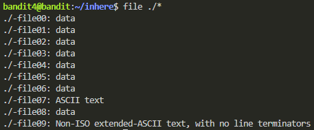
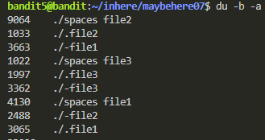

# To start off

You will need to connect to bandit servers via ssh banditX@bandit.labs.overthewire.org -p 2220, where X is the level that you want to connect to. After you've found the password for each level you can type 'exit' to start over and go to the next level.

To get a description of the command you can type "man" before the commando and a summary will show up. Ex:

```bash
man ls
```
You can also type 'reset' to clear the terminal for easier reading

```bash
reset
```

Another tip is that you can read files with having to jump through folders by just typing out the full directory like this:

```bash
cat inhere/maybehere07/-file2
```

# Bandit level 0

The goal of this level is for you to log into the game using SSH. The host to which you need to connect is bandit.labs.overthewire.org, on port 2220. The username is bandit0 and the password is bandit0. Once logged in, go to the Level 1 page to find out how to beat Level 1.

### Commands you may need to solve this level
ssh - SSH (Secure Shell) is a protocol that allows secure remote access and command execution on a remote server over an encrypted connection.

---
```bash
cat readme
```

# Bandit level 1

The password for the next level is stored in a file called - located in the home directory

### Commands you may need to solve this level

ls , cd , cat , file , du , find

---
```bash
cat < -
```

# Bandit level 2

The password for the next level is stored in a file called spaces in this filename located in the home directory

### Commands you may need to solve this level

ls , cd , cat , file , du , find

---
```bash
cat "spaces in this filename"
```

# Bandit level 3

The password for the next level is stored in a hidden file in the inhere directory. "-a" shows hidden files, then you can just read them using cat

### Commands you may need to solve this level

ls , cd , cat , file , du , find

---
```bash
ls -a
cat .hidden
```

# Bandit level 4

The password for the next level is stored in the only human-readable file in the inhere directory.

### Commands you may need to solve this level

ls , cd , cat , file , du , find 
---
```bash
file ./*
```



Lists the files in the directory along with their type. We can now easily see which of the files is readable (ASCII)

---
```bash
cat < -file07
```

# Bandit level 5

The password for the next level is stored in a file somewhere under the inhere directory and has all of the following properties:

- human-readable
- 1033 bytes in size
- not executable

### Commands you may need to solve this level

ls , cd , cat , file , du , find

Since we know how to check if its human readable, lets instead try searching for all files in the directory that is of the size 1033 bytes. 

---
```bash
find -type f -size 1033c
```

"-type f" Ensures that you're only searching for regular files and not directories or other types of files.

"-size 1033c" specifies the size condition, where "c" suffix indicates that the size is specified in bytes.

You can also list all files and their bytesize within the folder you're in by doing this:

```bash
du -b -a
```


--- 

# Bandit level 6

The password for the next level is stored somewhere on the server and has all of the following properties:

- owned by user bandit7
- owned by group bandit6
- 33 bytes in size

### Commands you may need to solve this level

ls , cd , cat , file , du , find , grep

First we use 'find' to search for all files that follows our conditions above:

---
```bash
find / -type f -size 33c -user bandit7 -group bandit6
```

"find /" - This initiates the find command starting from the root directory (/), meaning it will search the entire filesystem.
"-type f" - This restricts the search to only regular files (excludes directories, symbolic links, etc.).

We can then read through all the files in order to find something that doesn't have "permission denied" next to it, and in this case the file is simply named "/var/lib/dpkg/info/bandit7.password". Once we have this we can just easily type "cat /var/lib/dpkg/info/bandit7.password" in order to retrieve our password.


# Bandit level 7

The password for the next level is stored in the file data.txt next to the word millionth

### Commands you may need to solve this level

man, grep, sort, uniq, strings, base64, tr, tar, gzip, bzip2, xxd

---
```bash
grep "millionth" data.txt
```
This shows the entire row which has the word "millionth" in it. We also have to specify the file that we want to read.


# Bandit level 8

The password for the next level is stored in the file data.txt and is the only line of text that occurs only once

### Commands you may need to solve this level

grep, sort, uniq, strings, base64, tr, tar, gzip, bzip2, xxd

---
```bash
sort data.txt | uniq -u
```

"sort" is essential before using 'uniq' because 'uniq' only removes consecutive duplicate lines.
"uniq" used without any options, filters out consecutive identical lines
"-u" used with "uniq" prints only unique lines


# Bandit level 9

The password for the next level is stored in the file data.txt in one of the few human-readable strings, preceded by several ‘=’ characters.

### Commands you may need to solve this level

grep, sort, uniq, strings, base64, tr, tar, gzip, bzip2, xxd

---
```bash

```


# Bandit level 0


### Commands you may need to solve this level


---
```bash

```


