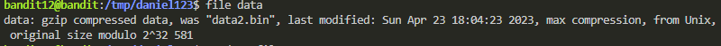
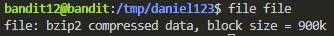

# CI/CD

* Continuous Integration --> Build, Test, Merge

* Continuous Delivery --> Automatically release to repository

* Continuous Deployment --> Automatically deploy to production

Automatically run pipelines on new code changes to check for issues or bugs.

Fast feedback loop for developers

Shared rules which lead to better code quality

Promotes transparency and knowledge sharing.

---
## CI/CD in practice

----
## Formatting

- Black - Same formatting that we've used before
- Import organizer - sorts all your imports (built in, third party & your own files)

---
## Tests

Find and fix errors before everything goes live. Obviously very important to save time and money in the future.

It's important to do tests when you're working, however, You don't need to do tests as often as it might seem. In other words; do tests, just not for every single row of code.

---
## Tests: Different types

### Unit tests:
Focus on verifying the smallest testable units of code. Functions or methods etc..

### Integration Tests

Verifies the interaction and integration between different modules or components.

### Regression Tests

Helps identifying unintended side effects or regressions caused by the modifications.

### Other tests

Acceptance tests, funtional tests, performance tests, security tests etc...
The tests that you will be using is going to based on the project you're in.

---
## Pytest

Most popular testing framework in Python. It can be used to create and run tests. Pytest will automatically find your tests if you start their names with "test".

---
## Pre-commit

Mini CI/CD that runs on you laptop every time you make a git commit. Saves alot of time since it's much quicker than Github CI/CD

---
## Honorable mentions (useful addons)

* **Flake8**: Can tell you if you have created variables that are never used and many more helpful code checks.
* **Ruff**: Replaces a bunch of tools. Looks like this will be the default tool soon - Older tools have better compatibility right now. Keep an eye on this, don't **need** to use it.