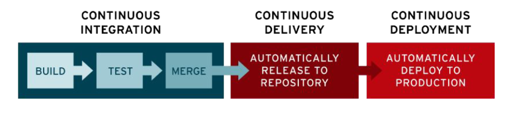

# CI/CD

* Automatically run pipelines on new code changes to check for issues or bugs.

* Fast feedback loop for developers

* Shared rules which lead to better code quality

* Promotes transparency and knowledge sharing.



---
## CI/CD in practice

1. Develop code changes
2. Commit and push code to Github
3. Github automatically detect new code and starts CI on a server which installs the project
4. CI tests the code and alerts the developer if there are any errors.
5. Developer fixes problem and starts CI again.

CI/CD can also do other things:
* Train and test the ML model.
* Create reports and share them with the shareholders
* Ask chatGPT for code improvements.

**KEEP IN MIND**: CI will run often, so you don't want it to be expensive (OpenAI API) or run very slowly (train a big ML model)

### What we will do in the project:

- Download code from github
- Install our python requirements into our venv.
- check our code for style/format errors.
- Run tests
----

## CI/CD Config File

Github reads the config file

**We can configure**: 
- When the workflow runs. Every git push. Every sunday.
- What OS should be used (Mac, Windows, ...)
- What Python version we should use. We can even repeat the same workflow with different Python versions.


## Formatting

- Black - Same formatting that we've used before
- Import organizer - sorts all your imports (built in, third party & your own files)

---
## Tests

Find and fix errors before everything goes live. Obviously very important to save time and money in the future.

It's important to do tests when you're working, however, You don't need to do tests as often as it might seem. In other words; do tests, just not for every single row of code.

---
## Tests: Different types

### Unit tests:
Focus on verifying the smallest testable units of code. Functions or methods etc..

### Integration Tests

Verifies the interaction and integration between different modules or components.

### Regression Tests

Helps identifying unintended side effects or regressions caused by the modifications.

### Other tests

Acceptance tests, funtional tests, performance tests, security tests etc...
The tests that you will be using is going to based on the project you're in.

---
## Pytest

Most popular testing framework in Python. It can be used to create and run tests. Pytest will automatically find your tests if you start their names with "test".


---
## Pre-commit

Mini CI/CD that runs on you laptop every time you make a git commit. Saves alot of time since it's much quicker than Github CI/CD

---
## Honorable mentions (useful addons)

* **Flake8**: Can tell you if you have created variables that are never used and many more helpful code checks.
* **Ruff**: Replaces a bunch of tools. Looks like this will be the default tool soon - Older tools have better compatibility right now. Keep an eye on this, don't **need** to use it.

# Installing Black & Isort

```bash
pipenv install black isort
```
When you've installed these packages you will find a new folder in your directory called "**.vscode**". In this folder you will find a .json file where you can change the settings for black and isort.

The settings below apply isort and black formatting everytime you save a file (so you don't have to change it manually)

```json
{
    "[python]": {
        "editor.defaultFormatter": "ms-python.black-formatter"
    },
    "editor.formatOnSave": true,
    "python.formatting.provider": "none",
    "python.formatting.blackArgs": [
        "--line-length",
        "119"
    ],
    "python.sortImports.args": [
        "--profile=black",
    ],
    "[python]": {
        "editor.codeActionsOnSave": {
            "source.organizeImports": true
        }
    }
}
```

# Using Pytest

First install

```bash
pipenv install black isort
```
If you've got multiple harddrives, you can check what harddrives are available and how much space is left.
```bash
pipenv df -h
```
Then you select your harddrive

```bash
cd :E
```
Once you've selected the correct harddrive navigate to correct folder/file

```bash
cd Data-engineering-AI22\Exercises\Exercise6-cicd-tools\test_print_joke.py
```

Now you can run the pytest command for your desired file

```bash
pytest -s test_print_joke.py
```
...and it should look something like this:


