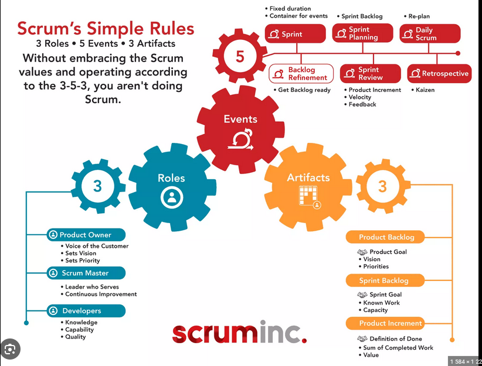

# Scrum overview infographic

# Scrum Definition

Lightweight framwork that helps people, teams and organizations generate value through adaptive solutions for complex problems. The Scrum framwork is purposefully incomplete, only defining the parts required to implement Scrum Theory. 

Rather than provide people with detailed instructions, the rules of Scrum guide their relationships and interactions.

---
### Scrum in a nutshell

Scrum requires a Scrum Master to foster an enviroment where:
1. A Product Owner orders the work for a complex problem into a Product Backlog. 
2. The Scrum Team turns a selection of the work into an increment of value during a Sprint.
3. The Scrum Team and its stakeholders inspect the results and adjust for the next Sprint.
4. Repeat

---
# Scrum Theory

Scrum combines four formal events for inspection and adaptation within a containing event, the Sprint. These events work because they implement the empirical Scrum pillars of **transpararency, inspection,** and       **adaption**

### Transparency

Ensures visibility for workers and recipients, influencing devision. Low transparency increases risks. Transparency is key for meaningful inspection.

### Inspection

Regular and careful inspection of Scrum artifacts and goals helps spot issues. Scrum's five events aid this. Without adaptation, inspection is futile.

### Adaptation

When a process or product is off-mark, immediate adjustments are needed. Effective adaptation requires empowered, self-managing teams. Scrum Teams should adapt upon any new insight.

---
# Scrum Values

### Commitment, Focus, Openness, Respect, & Courage

The Scrum Team is dedicated to its goals, prioritizes sprint tasks, and is transparent about challenges. They respect each other's abilities and are brave in addressing tough issues. These values guide their actions and decisions. 

---
# Scrum Team
A Scrum Team is a small unit comprising a Scrum Master, Product Owner, and Developers, with no sub-teams or hierarchies. They focus on one Product Goal. These teams are cross-functional and self-managing, determining tasks and methods internally. Typically, they have 10 or fewer members; smaller teams tend to be more efficient. If too large, they should split but maintain shared goals and resources. They handle all product tasks, from R&D to stakeholder interaction, and manage their own work. They aim for a valuable product every Sprint and have three main roles: Developers, Product Owner, and Scrum Master.

### Developers

* In the Scrum Team, responsible for crafting a usable Increment each Sprint.
* Skills vary based on work domain
* **Accountabilites**:
1. Creating the Sprint Backlog
2. Following a Definition of Done for quality
3. Daily adaptation towards the Sprint Goal
4. Keeping each other professionally accountable

### Product Owner

* Maximizes product value from the Scrum Team's work.
* Manages Product Backlog ensuring:
1. Clear Product Goal communication
2. Creation and communication of Product Backlog items.
3. Backlog item ordering.
4. Transparency and understanding of the Product Backlog.
* May delegate tasks but retains accountability
* Represents stakeholder needs in the Product Backlog; any changes need convinving the Product Owner.

### Scrum Master

* Ensures Scrum is correctly implemented.
* Aids in understanding Scrum theory and practice.
* Enhances Scrum Team's effectiveness.
* Serves Scrum Team by:
1. Coaching on self-management and cross-functionality.
2. Aiding focus on valuable Increments.
3. Removing obstacles.
4. Facilitating Scrum events.
* Assists Product Owner with:
1. Techniques for Goal and Backlog management.
2. Clarity in Backlog items.
3. Empirical planning in complex settings.
4. Facilitating stakeholder collaboration.
* Aids the organization in:
1. Leading and coaching in Scrum adoption.
2. Advising on Scrum implementation.
3. Educating on empirical approaches.
4. Bridging gaps between stakeholders and Scrum Teams.

---

# Scrum Events

### The Sprint
Fixed length events of one month or less to create consistency. A new Sprint starts immediately after the conclusion of the previous Sprint.

### During the Sprint:

* No changes are made that would endanger the Sprint Goal
* Quality does not decrease
* The Product Backlog is refined as needed; and,
* Scope may be clarified and renegotiated with the Product Owner as more is learned.

Sprints enable predictability by ensuring inspection and adaptation of progress toward a Product Goal at least every calender month. Shorter sprints can be employed to generate more learning cycles and limit risk of cost and effort to a smaller time frame.

### Sprint Planning

* **Purpose**: Initiates the Sprint, defining the work to be performed.
* **Collaboration**: The entire Scrum Team collaborates on the plan.
* **Role of Product Owner**:  Ensures attendees are prepared, discussing important Product Backlog items and their alignment with the Product Goal. Other individuals may be invited for advice.
* **Key Topics**: 
1. **Why is this Sprint valuable?** Product Owner proposes value additions, and the team collaborates on a Sprint Goal. This goal must be finalized by the end of the Sprint Planning.
2. **What can be Done this Sprint?** Developers, through discussions, select items from the Product Backlog for the Sprint. The selection process may refine items, enhancing clarity and confidence. The extent of completion is gauged based on past performance, upcoming capacity, and the Definition of Done.
3. **How will chosen work get done?** Developers plan the breakdown and execution of selected items, typically into tasks of a day or less. The methodology is at the Developers' discretion. The resultant is termed the Sprint Backlog.
* **Duration** Timeboxed to a maximum of eight hours for a one month Sprint; shorter for less than a month.

### Daily Scrum

* **Purpose**: Inspect progress toward the Sprint Goal and adapt the Sprint Backlog.
* **Format**: A 15-minute event for Developers, held consistently.
* **Participation**: If the Product Owner or Scrum Master is actively involved in the Sprint tasks, they join as Developers.
* **Focus**: Developers choose their format, aiming to emphasize progress towards the Sprint Goal and create a plan for the next day, fostering focus and self-management.
* **Benefits**: Enhances communication, identifies obstacles, supports swift devision-making, and minimizes the need for other meetings.
* **Flexibility**: Daily Scrum is not the only planning time. Developers can discuss and adjust plans throughout the day.

### Sprint Retrospective

The **purpose** is to plan ways to increase quality and effectiveness through retrospection of a previous Sprint.

The Scrum Team inspect last Sprint with regards to **individuals, interactions, processes, tools,** and **their Definition of Done.**
* Inspected elements often vary with the domain of work.
* Assumptions that led them astray are identified and their origins explored.
* Scrum Team discusses what went well and what didn't, and how those problems were (or were not) solved.
* **The Sprint Retrospective** concludes the **Sprint** - Timeboxed to a max 3 hours for a one-month **Sprint**.

---
# Scrum Artifacts

**Purpose**:

Artifacts in Scrum symbolize work or value and are structured to optimize the transparency of vital information, ensuring a consistent basis for modification for all evaluators.

**Commitments**:
* **Product Backlog**: Guided by the **Product Goal**.
* **Sprint Backlog**: Anchored by the **Sprint Goal**.
* **Increment**: Governed by the **Definition of Done**.

 **Significance**:

These commitments bolster empirical practices and uphold the Scrum values, benefiting both the Scrum Team and associated stakeholders.

## Product Backlog

* An evolving list detailing product enhancements.
* Items are calrified via refinement, where they're detailed and sized.
* Developers size tasks; the Product Owner aids in understanding options.

### Commitment: Product Goal 

* A future vision of the product in the Product Backlog.
* A product delivers value and can be a service, tangible item, or abstract.
* Acts as a sustained aim for the team; one goal must be concluded before another.